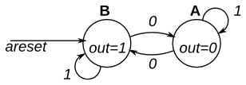

# FSMs — binary vs. one-hot encoding

Two FSMs, each in a v1 (binary, enum) and a v2 (hand-coded one-hot) variant,
to see when one-hot encoding pays off.

## Layout

| Path | Contents |
|------|----------|
| `rtl/fsm_design.sv` | two-state FSM, v1 binary |
| `rtl/fsm_design_onehot.sv` | two-state FSM, v2 one-hot |
| `rtl/pattern_detector.sv` | `110101` detector, v1 binary |
| `rtl/pattern_detector_onehot.sv` | `110101` detector, v2 one-hot |
| `tb/fsm_tb.sv` | self-checking TB for the two-state FSM |
| `tb/tb_pattern_detector.sv` | self-checking TB for the pattern detector |
| `synth/stat_*.txt` | committed Yosys `stat` + logic depth per variant |
| `synth/toggles_*.txt` | committed per-signal toggle counts (RTL + gate-level) |
| `docs/` | state diagrams |
| `build/` | generated: sim binaries, VCDs, netlists, logs, `.dot` schematics (gitignored) |

Each TB picks its DUT with `-DDUT=<module>`, so both variants run the same tests.
Run `make` for sim + synth + compare, `make equiv` for formal equivalence, and
`make toggles` for switching activity. Single targets work too, e.g.
`make sim-pattern_detector_onehot`.

All results: Yosys 0.58 generic `synth`, Icarus 12.

---

## 1. Two-state FSM (`fsm_design`)

- Moore FSM, two states **A** and **B**, async active-low reset to **B**.
- `in = 1` → stay in current state; `in = 0` → toggle.
- `out = 1` in **B**, `0` in **A**.

| | v1 binary | v2 one-hot |
|---|---|---|
| State flops | 1 (`$_DFF_PN1_`) | 2 (`$_DFF_PN0_`, `$_DFF_PN1_`) |
| Comb cells | 1 `$_XNOR_` | 2 `$_MUX_` |
| **Total cells** | **2** | **4** |
| Logic depth | 1 | 1 |
| Output decode | `out = state` (free: enum encodes B as 1) | `out = state[B]` (free) |
| Sim (223 checks) | pass | pass |
| Equivalent to v1 | — | yes (bounded, 25 cycles from reset) |

**Winner: v1.**

- **One-hot is worse here.** With 2 states binary is already 1 bit, so one-hot
  just adds a flop and doubles the next-state logic.
- **v1 collapses to `next = state XNOR in`.** `in ? state : ~state` is exactly XNOR.
- **v2 next-state bits become muxes.** `(state[B] & in) | (state[A] & ~in)`
  is `in ? state[B] : state[A]`, which Yosys maps to a single `$_MUX_`.
- **Power.** v2 has 2 flops on the clock instead of 1 (more clock load), and
  *both* flops toggle on every state change, while v1 toggles one.
- **Robustness.** v2 has 2 illegal states (`00`, `11`) that it can never leave;
  v1 has no illegal states at all.
- **Yosys did not re-encode v1.** `FSM_DETECT` found no FSM (the state register
  drives the output directly), so the encoding we wrote is what got built.

---

## 2. Pattern detector (`pattern_detector`)

- Moore FSM, detects `110101` on a serial input, overlapping matches allowed.
- 7 states: `IDLE, S1, S11, S110, S1101, S11010, S110101` (named after the
  matched prefix); `out = 1` in `S110101`. Async active-low reset to `IDLE`.

| | v1 binary | v2 one-hot |
|---|---|---|
| State flops | 3 | 7 |
| Comb cells | 33 | 14 |
| **Total cells** | **36** | **21** |
| Logic depth | 7 | 5 |
| Output decode | `state == S110101` (3-bit compare) | `state[S110101_BIT]` (free) |
| Sim (264 checks) | pass | pass |
| Equivalent to v1 | — | yes (bounded, 25 cycles from reset) |

**Winner: v2** — 42% fewer cells and 2 fewer logic levels, despite 4 extra flops.

- **This is where one-hot pays off.** In v1 every transition needs a full 3-bit
  decode of `state` and then a 3-bit re-encode of `next_state`. In v2 each
  next-state bit is just `in`/`~in` ANDed with an OR of the source states
  (e.g. `S1101 ← in & S110`), so most bits are a single gate.
- **Transitions are sparse.** Each state has only 1–5 predecessors, so each
  one-hot equation stays tiny. The worst ones are `IDLE` (5 predecessors) and
  `S11` (4), which set the logic depth.
- **Area is still a trade.** v2 has 4 more flops; on real silicon a flop is
  several times the area of a simple gate, so the generic cell count
  overstates v2's win. Needs a liberty-mapped comparison (see next experiments).
- **Yosys did not re-encode v1** ("circuit seems to be self-resetting"), so v1 is
  the plain binary encoding.
- **Unused states.** v1 has one unused code (`3'b111`), handled with
  `default: next_state = IDLE`. v2 has 2⁷ − 7 = 121 illegal codes and no recovery.

---

## 3. Switching activity (power proxy)

### How it's measured

Dynamic power ≈ α·C·V²·f. V and f are the same for both variants, so the
comparison comes down to **how often each net switches (α)** and **how much
capacitance switches (C)**. `make toggles` measures α:

1. The TB dumps a VCD: every value change of every signal, with timestamps.
2. `make gls` re-runs the **same TB against the Yosys netlist**, so the VCD also
   contains every internal gate output (`_08_`, `_17_`, …), not just the
   signals named in the RTL.
3. [`scripts/vcd_toggles.py`](../scripts/vcd_toggles.py) counts per-bit 0↔1
   transitions for every net in the `dut` scope (ignoring the initial value and
   x/z), and separates clock, inputs and internal nets.
4. Both variants get identical stimulus (same TB, same seed) — confirmed by
   identical `in` and `clk` toggle counts.

### Results

Internal toggles = all DUT nets except `clk` and inputs. Clock-pin toggles =
flops × clock toggles (each flop's clock pin switches every edge, even when
its data doesn't).

| | cycles | RTL internal | **Gate-level internal** | per cycle | flops | clock-pin toggles |
|---|---|---|---|---|---|---|
| `fsm_design` (binary) | 211 | 397 | **397** | 1.9 | 1 | 422 |
| `fsm_design_onehot` | 211 | 692 | **692** | 3.3 | 2 | 844 |
| `pattern_detector` (binary) | 269 | 674 | **3086** | 11.5 | 3 | 1617 |
| `pattern_detector_onehot` | 269 | 890 | **1568** | 5.8 | 7 | 3773 |

### Observations

- **Two-state FSM: one-hot switches 1.7× more** on data nets and has 2× the
  clock-pin load. Binary wins on every count. (RTL = gate-level here: the
  netlist has no internal nets beyond `state`/`next_state`.)
- **Pattern detector: RTL counts point the wrong way.** At RTL, one-hot looks
  *worse* (890 vs 674), because it flips 2 state bits per transition while
  binary flips ~1.5 on average (276 vs. 376 bit flips over the same
  188 state changes). But RTL only sees named signals. At gate level,
  binary's 33-gate decode/encode logic churns on every cycle, and **one-hot
  switches half as much (1568 vs 3086)**. **Measure power at gate level, not RTL.**
- **…but one-hot pays on the clock.** 7 flops vs. 3 means 2.3× the clock-pin
  toggles. Data toggles favor one-hot by 2×, clock load favors binary by 2.3×,
  and which one wins overall depends on capacitance per net vs. per clock pin —
  which needs a real cell library (see next experiments).
- **Lower bound.** The gate-level sim is zero-delay, so it has no glitches.
  With real gate delays, binary's deeper logic (depth 7 vs. 5) would glitch
  more, widening one-hot's lead on data toggles.

---

## Bugs found along the way

- **Bare `enum` is 32 bits (both v1 designs).** `typedef enum {A, B}` has no base
  type, so it's an `int`, and a `case` covering only the named states is
  incomplete. Yosys errors with *"Latch inferred for signal next_state"*. Fixed
  with `enum logic` / `enum logic [2:0]` (+ `default` for the unused code).
  Simulation didn't catch it; only synthesis did. **Always give enums an
  explicit base type.**
- **Pattern detector TB didn't compile in Icarus.** It used `state_t'(...)`
  casts and enum `.name()`, which Icarus 12 doesn't support. Replaced with
  `if`/`else` assignments and a `state_name()` helper function.
- **Pattern detector directed tests silently didn't run.** `foreach` over a
  `string` is broken in Icarus: it applied only the first bit of each sequence,
  so `single_match`, `back_to_back` and `overlapping` never checked a match
  (208 checks instead of 264, and still "PASSED"). Replaced with an indexed
  `for` loop. **Check the check count, not just PASS.**

## Next experiments

- [ ] Turn toggles into µW: sky130 liberty + OpenSTA `read_vcd` / `report_power`,
      to settle data-toggle vs. clock-load for the pattern detector.
- [ ] Map to a real liberty file (e.g. sky130) with `dfflibmap` + `abc -liberty`
      to compare area in µm² instead of generic cell count — especially for the
      pattern detector, where v2 trades 4 extra flops for fewer gates.
- [ ] Try Yosys `(* fsm_encoding = "one-hot" *)` on the enum and compare with the hand-coded v2.
- [ ] One-hot with an all-zeros `IDLE` ("one-hot-zero"): saves a flop in the pattern detector.
- [ ] Add illegal-state recovery to the one-hot variants and measure the cost.
- [ ] Make the equivalence checks unbounded (`sat -tempinduct`, or SymbiYosys).
